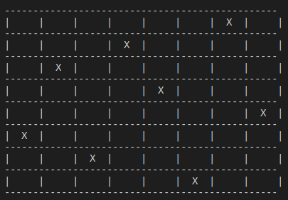
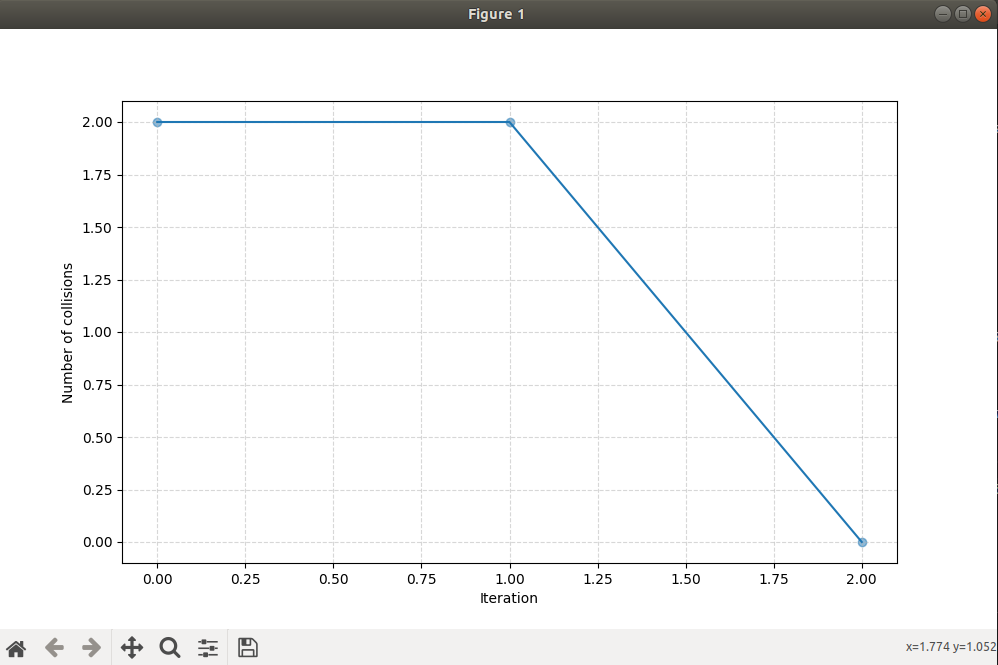

### N-Queens problem

The eight queens problem is the problem of placing eight queens on an 8×8 chessboard such that none of them attack one another (no two are in the same row, column, or diagonal).

We used genetic algorithms in order to solve this problem.


### GA's parameters

- *Elites* number of fittest chromosomes to keep after each generation
- *population_size* number of chromosomes 
- *max_generations* number of generations 
- *crossover rate* pre-defined parameter of the crossover rate, equals to *0.8*
- *mutation rate* pre-defined parameter of the mutaion rate, equals to *0.2*

### Testing
The class *GeneticAlgorithm* implements the needed algorithms such as *crossingOver*, *mutation*, *selection*, *fitness calculation* and *evolving*

```python
data = [0, 1, 2, 3, 4, 5, 6, 7]
ga = GeneticAlgorithm(data, max_weight=12210, max_volume=12, max_generations=60, population_size=200, elites=2) 
```

To run the algorithm,
```python
ga.run()
```

To print the evolution graph:
```python
ga.printEvolutionGraph()
```


